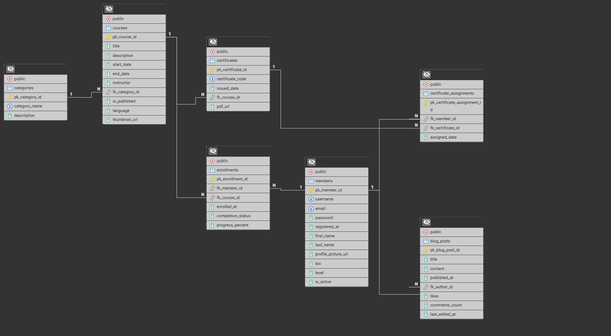

# Turk Student Community PostgreSQL Projesi  
**Konu :** Online Eğitim Veritabanı  
**Kullanılan SQL :** PostgreSQL  

> Bu depo; çevrimiçi eğitim platformu için tasarlanan PostgreSQL şemasını, ER diyagramını, örnek veri setlerini ve temel görünümleri (view) içerir. Proje, **veritabanı tasarım prensiplerini** pratik bir senaryoda uygulamanızı hedefler.

---

## 📂 Depo İçeriği

| Yol / Dosya                | Açıklama                                                                                 |
|----------------------------|------------------------------------------------------------------------------------------|
| `online_edu_db.sql`        | Tüm tablo tanımları, PK–FK–UK kısıtları ve indeksler                                     |
| `online_edu_seed_data.sql` | Örnek veri eklemek için INSERT sırası ve komutları                                       |
| `Views/`                   | Platform için hazırlanan 4 adet view (`vw_*.sql`)                                        |
| `Inserts/`                 | Ek veya genişletilmiş veri setleri                                                       |
| `ER_diagram.png`           | ER diyagramının statik PNG çıktısı                                                      |

> **Not :** Entity-Relationship şeması aynı zamanda Mermaid ile de yazılmıştır; ilgilenenler için kaynak kodu aşağıda.

---

## 🗄️ Tablolar ve Anahtar Özet Tablosu

| Tablo | Birincil Anahtar | Yabancı Anahtar(lar) | Amaç / Önemli Sütunlar |
|-------|------------------|----------------------|------------------------|
| **members** | `pk_member_id` | – | `username`, `email` (UK); profil bilgileri |
| **categories** | `pk_category_id` | – | Kurs kategorileri |
| **courses** | `pk_course_id` | `fk_category_id → categories` | Kurs meta verileri |
| **enrollments** | `pk_enrollment_id` | `fk_member_id → members` `fk_course_id → courses` | **Çok-çok** ilişkiyi yönetir; ilerleme bilgisi içerir |
| **certificates** | `pk_certificate_id` | `fk_course_id → courses` | Kurs bazlı sertifikalar |
| **certificate_assignments** | `pk_certificate_assignment_id` | `fk_member_id → members` `fk_certificate_id → certificates` | Kullanıcı-sertifika eşlemesi |
| **blog_posts** | `pk_blog_post_id` | `fk_author_id → members` | Blog içeriği; etkileşim sayaçları |

---

## 🖼️ ER Diyagramı

---

## 🔗 İlişki Türleri Açıklaması

| İlişki             | Tablolar                                                       | Açıklama                                                                                                   |
|--------------------|----------------------------------------------------------------|-------------------------------------------------------------------------------------------------------------|
| **1 – N (bir-çok)** | `categories` → `courses`                                       | Bir kategori, birden fazla kurs içerebilir.                                                                 |
| **M – N (çok-çok)** | `members` ↔ `courses`  (ara tablo: `enrollments`) | Bir üye çok sayıda kursa katılabilir; bir kursa çok sayıda üye katılabilir.                                 |
| **1 – N (bir-çok)** | `courses` → `certificates`                                     | Her kurs, o kursa ait birçok sertifika kaydına sahip olabilir.                                             |
| **M – N (çok-çok)** | `members` ↔ `certificates`  (ara tablo: `certificate_assignments`) | Bir üye çok sayıda sertifika alabilir; aynı sertifika birden fazla üyeye atanabilir. |
| **1 – N (bir-çok)** | `members` → `blog_posts`                                       | Bir üye birden çok blog yazısı yayımlayabilir.                                                              |
